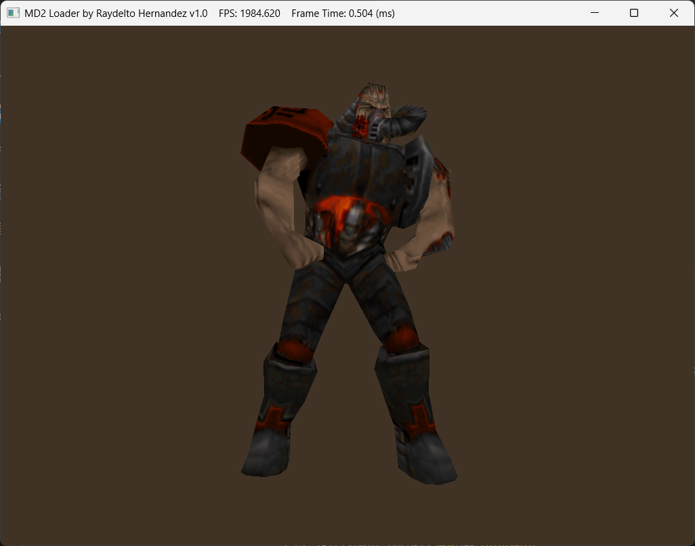

# OpenGL MD2 Loader

A modern C++17 OpenGL Quake 2 (MD2) model loader with animation support, built with GLFW and GLEW.

## Features

- MD2 model loading with frame interpolation
- Custom TGA texture loader
- GPU-based vertex interpolation for smooth animations
- Modern C++ with RAII and `std::vector`
- Clean separation of concerns (rendering, I/O, OpenGL management)

## Building on Windows with MSYS2/MinGW64

### Prerequisites

#### 1. Install MSYS2

Download and install MSYS2 from [https://www.msys2.org/](https://www.msys2.org/)

Default installation path: `C:\msys64`

#### 2. Update MSYS2

Open **MSYS2 MSYS** terminal and update the package database:

```bash
pacman -Syu
```

Close and reopen the terminal, then run again:

```bash
pacman -Su
```

#### 3. Install Required Libraries

Open **MSYS2 MinGW64** terminal (not MSYS2 MSYS!) and install the development tools and libraries:

```bash
# Install MinGW64 GCC toolchain
pacman -S mingw-w64-x86_64-gcc

# Install Make
pacman -S mingw-w64-x86_64-make

# Install OpenGL libraries
pacman -S mingw-w64-x86_64-glew
pacman -S mingw-w64-x86_64-glfw

# Install GLM (OpenGL Mathematics library)
pacman -S mingw-w64-x86_64-glm
```

Or install all at once:

```bash
pacman -S mingw-w64-x86_64-gcc mingw-w64-x86_64-make mingw-w64-x86_64-glew mingw-w64-x86_64-glfw mingw-w64-x86_64-glm
```

#### 4. Configure MinGW64 Environment

**Option A: Use MSYS2 MinGW64 Terminal (Recommended)**
- Always launch **MSYS2 MinGW64** (not MSYS2 MSYS or UCRT64)
- This terminal has the correct PATH pre-configured

**Option B: Use Windows Terminal (PowerShell/CMD)**
- Add `C:\msys64\mingw64\bin` to your system PATH
- Required DLLs will be accessible: `glew32.dll`, `glfw3.dll`, etc.

### Building the Project

#### From MSYS2 MinGW64 Terminal

1. Navigate to project directory:
```bash
cd /c/git/simple-opengl
```

2. Create bin directory (if it doesn't exist):
```bash
mkdir -p bin
```

3. Build using Make:
```bash
make
```

The build output will be `bin/main.exe`.

4. Clean build artifacts:
```bash
make clean
```

#### From Windows PowerShell/CMD

If MinGW64 is in your PATH:

```powershell
# Create bin directory
mkdir bin -Force

# Build
make

# Clean
make clean
```

**Note:** The Makefile uses hardcoded paths to `C:\msys64\mingw64` for includes and libraries. If MSYS2 is installed elsewhere, edit the `Makefile` `INCLUDES` and `LIBS` variables accordingly.

### Running the Application

From MSYS2 MinGW64 terminal:
```bash
./bin/main.exe
```

From Windows PowerShell:
```powershell
.\bin\main.exe
```

From Windows Command Prompt:
```cmd
bin\main.exe
```

## Usage

When the application launches, an animated MD2 model (cyborg character) will render with smooth frame interpolation.

**Controls:**
- **SPACE**: Pause/resume rotation
- **F1**: Toggle wireframe mode
- **ESC**: Exit application

### Available MD2 Models

The `data/` directory includes several MD2 models with textures:
- `cyborg.md2` / `cyborg1-3.tga` (default)
- `female.md2` / `female.tga`
- `grunt.md2` / `grunt.tga`
- `tris.md2` / `skin.tga`

To use a different model, edit `src/main.cpp` line 35:
```cpp
md2model::Md2 player("data/cyborg.md2", "data/cyborg3.tga");
```

## Project Structure

```
simple-opengl/
├── src/
│   ├── main.cpp              # Application entry point
│   ├── Md2.cpp/h             # MD2 model loader and renderer
│   ├── OpenGLHandler.cpp/h   # OpenGL/GLFW initialization
│   ├── ShaderProgram.cpp/h   # GLSL shader management
│   ├── Texture2D.cpp/h       # Texture loading
│   └── TgaLoader.cpp/h       # TGA image format loader
├── shaders/
│   ├── basic.vert            # Vertex shader with interpolation
│   └── basic.frag            # Fragment shader
├── data/
│   ├── *.md2                 # MD2 model files (cyborg, female, grunt, tris)
│   └── *.tga                 # Texture files
├── bin/                      # Build output (generated)
└── Makefile                  # Build configuration (MinGW64)
```

## Technical Details

- **Language**: C++17
- **Graphics API**: OpenGL 3.3 Core Profile
- **Libraries**: 
  - GLEW (OpenGL Extension Wrangler)
  - GLFW3 (Window and input management)
  - GLM (OpenGL Mathematics - header-only)
- **Build System**: GNU Make
- **Compiler**: MinGW64 GCC (via MSYS2)

## Troubleshooting

### "Cannot find -lglew32" or similar linker errors

Make sure you installed the libraries in the **MinGW64** environment (not MSYS2 or UCRT64):
```bash
pacman -S mingw-w64-x86_64-glew mingw-w64-x86_64-glfw
```

Verify installation:
```bash
ls /mingw64/lib/libglew32.a
ls /mingw64/lib/libglfw3.a
ls /mingw64/include/glm/glm.hpp
```

### "command not found: make"

**Solution A:** Use the MSYS2 MinGW64 terminal (has `make` by default)

**Solution B:** Install make for MinGW64:
```bash
pacman -S mingw-w64-x86_64-make
```

**Solution C:** Use `mingw32-make` instead of `make`

### "g++: command not found"

Install the GCC compiler:
```bash
pacman -S mingw-w64-x86_64-gcc
```

### Application doesn't run / Missing DLL errors

**Symptom:** `glew32.dll`, `glfw3.dll`, or `libstdc++-6.dll` not found

**Solution A:** Run from MSYS2 MinGW64 terminal (has correct PATH)

**Solution B:** Add to Windows PATH:
```
C:\msys64\mingw64\bin
```

**Solution C:** Copy required DLLs to `bin/` directory:
```bash
cp /mingw64/bin/glew32.dll bin/
cp /mingw64/bin/glfw3.dll bin/
cp /mingw64/bin/libstdc++-6.dll bin/
cp /mingw64/bin/libgcc_s_seh-1.dll bin/
cp /mingw64/bin/libwinpthread-1.dll bin/
```

### Wrong MSYS2 environment

Make sure you're using **MSYS2 MinGW64**, not:
- MSYS2 MSYS (uses different toolchain)
- MSYS2 UCRT64 (different C runtime)
- MSYS2 CLANG64 (different compiler)

### Makefile path issues

If MSYS2 is not installed at `C:\msys64`, edit the `Makefile` and update:
```makefile
INCLUDES = -I<your_msys2_path>\mingw64\include
LIBS = -L<your_msys2_path>\mingw64\lib ...
```

## Screenshot



## Author

Raydelto Hernandez (raydelto@yahoo.com)

